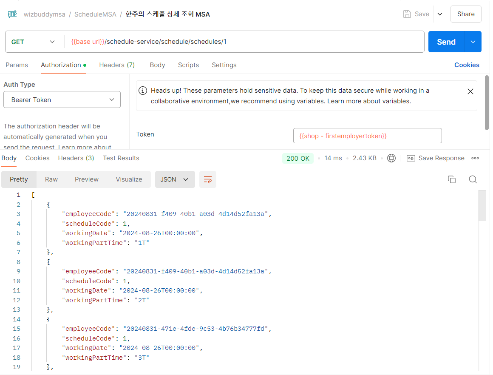
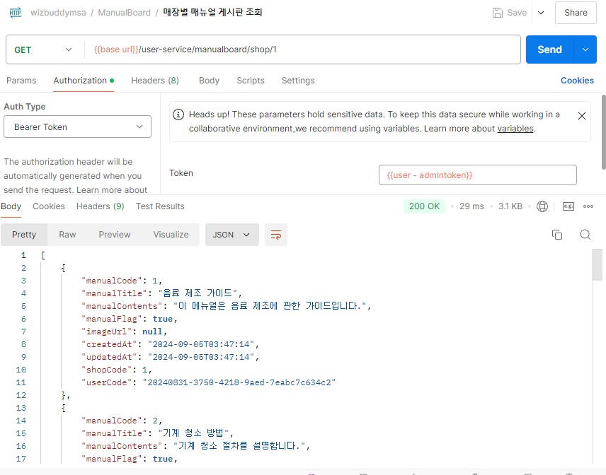
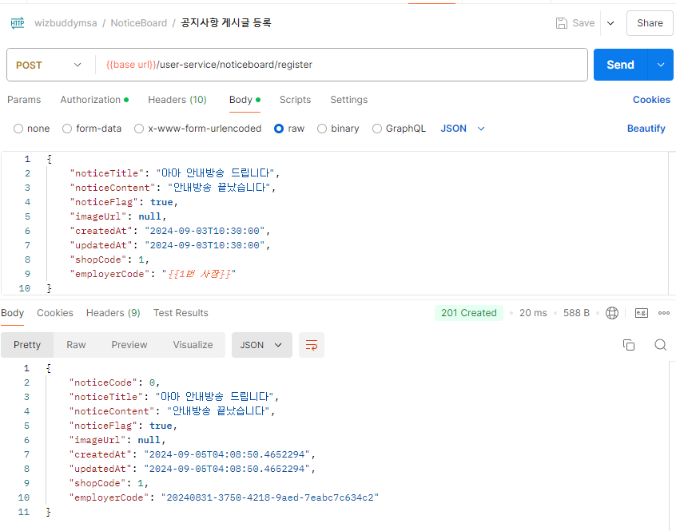
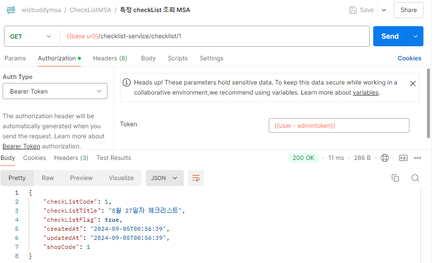

# 🔗 위즈버디 _ WizBuddy

 
 

# 🐼 Group 4 Team Member - `Int4_Byte`

|  |  |  |  |  | 
| :----------------------------------------------------------: | :----------------------------------------------------------: | :----------------------------------------------------------: | :----------------------------------------------------------: | :----------------------------------------------------------: |
|                            조제훈                            |                            백경석                            |                            유제은                            |                            이나현                            |                            이서현                            |
|   ` ESFJ `|   ` ENTP `|   ` INFP `|   ` ENTJ `|   ` INFJ `|

  

# 🛠️ Technical Stack
<!--## Frontend

-->

## ⚙️ Backend

<!---->
<!---->

## 💽 DB
<!---->

<!--!-->

## ⛓️‍💥 Server

<!--!## DevOps

-->

## ⚙ Tool
 &nbsp;  &nbsp;  &nbsp; <!-- &nbsp; -->

  

#  🚩 프로젝트 개요
## :one: 프로젝트 소개
사장님과 아르바이트생을 위한 스마트 매니지먼트 솔루션, **WIZ BUDDY**  
- **W(Work)**: 업무 효율을 극대화하는 최적의 파트너  
- **I(Instant)**: 즉시 문제를 해결하고 소통을 원활하게  
- **Z(Zero)**: 스트레스 없이 모든 업무를 간편하게 관리  

## :two: 프로젝트 필요성
### 1. 사장님
  
- 23년 12월 매장을 운영하고 있는 사장님을 대상으로 설문조사를 시행한 결과, 아르바이트생의 근태관리가 사업장을 운영할 때 어려운 점 1위로 선정되었습니다.
- 이를 바탕으로, 사장님들은 매장을 운영하면서도 아르바이트생도 관리해야 한다는 어려움을 겪고 있는 것을 알 수 있었습니다.

### 2. 아르바이트생
  
- 아르바이트를 할 때, 대부분의 사업장에서 공지사항 전달, 스케줄 관리를 위해 카카오톡을 사용합니다.
- 20년 12월 아르바이트생을 대상으로 한 설문 조사 결과 5명 중 4명이 단톡방으로 인해 스트레스를 받는다는 결과를 볼 수 있었습니다.  

- 이를 통해 카카오톡이 아닌 다른 곳에서 아르바이트 관련 전달사항, 업무 등을 처리할 수 있는 서비스가 필요해 이 서비스를 기획하였습니다.
- 사장님은 아르바이트생의 근태, 스케줄, 업무 관리를 한 곳에서 수행할 수 있습니다.
- 아르바이트생은 일상과 업무를 분리할 수 있고, 스케줄 조정, 공지사항, 업무 체크리스트 등의 기능을 통해 업무를 더욱 효율적으로 수행할 수 있습니다.

## :three: 유사 서비스 및 차별화 전략
### 1. 워키도키
  
- 아르바이트 추천, 업무 체크리스트 등의 기능 제공

### 2. 샵솔
 
   
- 출퇴근 관리, 자동 급여 계산, 급여 명세서, 체크리스트, 업무일지, 바코드 인식을 통한 유통기한 관리 등의 기능 제공

### 3. 차별화 전략

## :four: 프로젝트 주요 기능
### 1. 업무 체크리스트
- 사장님의 입장에서는 아르바이트생이 업무를 제대로 수행하고 있는지 쉽게 확인이 가능하고, 아르바이트생의 입장에서는 어떤 업무를 해야 하는지 빠르게 파악이 가능합니다.
    
### 2. 업무 캘린더
- 사장님이 일주일 근무 스케줄을 게시하면 아르바이트생들은 근무 일정을 한 눈에 확인할 수 있습니다.
    
### 3. 스케줄 조정 기능
- 아르바이트생들은 사장님께 일일이 전달하지 않고도 다른 아르바이트생들과 서비스 내에서 쉽게 스케줄을 변경할 수 있습니다.

  

# 🚩 WBS
### [🔗 WBS 바로가기](https://docs.google.com/spreadsheets/d/11AirCDIcRRg-C22BVh2cYn6UemvdJoVKG5yCrohsYk4/edit?gid=363407194#gid=363407194)
 

  

# 🚩 요구사항
### [🔗 요구사항 정의서 바로가기](https://docs.google.com/spreadsheets/d/11AirCDIcRRg-C22BVh2cYn6UemvdJoVKG5yCrohsYk4/edit?gid=0#gid=0)
 

  

# 🚩 DDD (Domain Driven Design) 설계
## :one: Domain Event Storming

  

## :two: Bounded Context

  

## :three: Context Map

  

# 🚩 DB모델링
## :one: 논리 모델링

  

## :two: 물리 모델링

  

## :three: 테이블 생성

  
<strong>DDL</strong>

    DROP TABLE IF EXISTS Comments;
    DROP TABLE IF EXISTS Substitution_Board;
    DROP TABLE IF EXISTS NoticeBoardLiked;
    DROP TABLE IF EXISTS Notice_Board;
    DROP TABLE IF EXISTS manualboardliked;
    DROP TABLE IF EXISTS manual_board;
    DROP TABLE IF EXISTS employee_working_part;
    DROP TABLE if EXISTS employeeworkingpart;
    DROP TABLE IF EXISTS Weekly_Schedule;
    DROP TABLE IF EXISTS TaskPerChecklist;
    DROP TABLE IF EXISTS Task;
    DROP TABLE IF EXISTS check_list;
    DROP TABLE IF EXISTS EmployeePerShop;
    DROP TABLE IF EXISTS Shop;
    DROP TABLE IF EXISTS EmployeeBlacklist;
    DROP TABLE IF EXISTS EmployerBlacklist;
    DROP TABLE IF EXISTS Employee;
    DROP TABLE IF EXISTS Employer;
    DROP TABLE IF EXISTS Users;

     CREATE TABLE Users (
                       user_code VARCHAR(255) PRIMARY KEY,
                       user_type VARCHAR(255) NOT NULL,
                       user_email VARCHAR(255) NOT NULL,
                       user_password VARCHAR(255) NOT NULL
    );

    CREATE TABLE Users (
                       user_code VARCHAR(255) PRIMARY KEY,
                       user_type VARCHAR(255) NOT NULL,
                       user_email VARCHAR(255) NOT NULL,
                       user_password VARCHAR(255) NOT NULL
    );

    CREATE TABLE Employer (
                          employer_code VARCHAR(255),
                          PRIMARY KEY (employer_code),
                          employer_name VARCHAR(255) NOT NULL,
                          employer_email VARCHAR(255) NOT NULL,
                          employer_password VARCHAR(255) NOT NULL,
                          employer_phone VARCHAR(255) NOT NULL,
                          employer_flag BOOLEAN DEFAULT TRUE NOT NULL,
                          employer_black_state BOOLEAN DEFAULT FALSE NOT NULL,
                          created_at DATETIME DEFAULT CURRENT_TIMESTAMP NOT NULL,
                          updated_at DATETIME DEFAULT CURRENT_TIMESTAMP NOT NULL,
                          FOREIGN KEY (employer_code) REFERENCES Users(user_code) ON DELETE CASCADE
    );

    CREATE TABLE Employee (
                          employee_code VARCHAR(255),
                          PRIMARY KEY (employee_code),
                          employee_name VARCHAR(255) NOT NULL,
                          employee_email VARCHAR(255) NOT NULL,
                          employee_password VARCHAR(255) NOT NULL,
                          employee_phone VARCHAR(255) NOT NULL,
                          employee_flag BOOLEAN DEFAULT TRUE NOT NULL,
                          latitude VARCHAR(255),
                          longitude VARCHAR(255),
                          employee_wage INTEGER,
                          employee_health_date DATE,
                          employee_black_state BOOLEAN DEFAULT FALSE NOT NULL,
                          created_at DATETIME DEFAULT CURRENT_TIMESTAMP NOT NULL,
                          updated_at DATETIME DEFAULT CURRENT_TIMESTAMP NOT NULL,
                          FOREIGN KEY (employee_code) REFERENCES Users(user_code) ON DELETE CASCADE
    );

    CREATE TABLE EmployerBlacklist (
                                   employer_black_code INTEGER(11) AUTO_INCREMENT PRIMARY KEY,
                                   employer_black_date DATETIME NOT NULL,
                                   employer_black_reason VARCHAR(255) NOT NULL,
                                   employer_code VARCHAR(255),
                                   FOREIGN KEY (employer_code) REFERENCES Employer(employer_code) ON DELETE CASCADE
    );

    CREATE TABLE EmployeeBlacklist (
                                   employee_black_code INTEGER(11) AUTO_INCREMENT PRIMARY KEY,
                                   employee_black_date DATETIME NOT NULL,
                                   employee_black_reason VARCHAR(255) NOT NULL,
                                   employee_code VARCHAR(255),
                                   FOREIGN KEY (employee_code) REFERENCES Employee(employee_code) ON DELETE CASCADE
    );

    CREATE TABLE Shop (
                      shop_code INTEGER(11) AUTO_INCREMENT PRIMARY KEY,
                      shop_name VARCHAR(255) NOT NULL,
                      shop_location VARCHAR(255) NOT NULL,
                      shop_flag BOOLEAN DEFAULT TRUE NOT NULL,
                      shop_open_time TIME NOT NULL,
                      business_num VARCHAR(255) NOT NULL,
                      created_at DATETIME DEFAULT CURRENT_TIMESTAMP NOT NULL,
                      updated_at DATETIME DEFAULT CURRENT_TIMESTAMP NOT NULL,
                      employer_code VARCHAR(255),
                      FOREIGN KEY (employer_code) REFERENCES Employer(employer_code) ON DELETE SET NULL
    );

    CREATE TABLE EmployeePerShop (
                                 shop_code INTEGER,
                                 employee_code VARCHAR(255),
                                 PRIMARY KEY (shop_code, employee_code),
                                 shop_hourly_wage INTEGER NOT NULL,
                                 shop_monthly_wage TINYINT NOT NULL,  -- 월급일을 DAY로 저장 (1~31)
                                 FOREIGN KEY (shop_code) REFERENCES Shop(shop_code) ON DELETE CASCADE,
                                 FOREIGN KEY (employee_code) REFERENCES Employee(employee_code) ON DELETE CASCADE
    );

    CREATE TABLE Check_list (
                            checklist_code INTEGER(11) AUTO_INCREMENT PRIMARY KEY,
                            checklist_title VARCHAR(255) NOT NULL,
                            checklist_flag BOOLEAN DEFAULT TRUE NOT NULL,
                            created_at DATETIME DEFAULT CURRENT_TIMESTAMP NOT NULL,
                            updated_at DATETIME DEFAULT CURRENT_TIMESTAMP NOT NULL,
                            shop_code INTEGER,
                            FOREIGN KEY (shop_code) REFERENCES shop(shop_code) ON DELETE CASCADE
    );

    CREATE TABLE Task (
                      task_code INTEGER(11) AUTO_INCREMENT PRIMARY KEY,
                      task_contents MEDIUMTEXT NOT NULL,
                      task_flag BOOLEAN DEFAULT TRUE NOT NULL,
                      task_fixed_state BOOLEAN DEFAULT FALSE NOT NULL,
                      created_at DATETIME DEFAULT CURRENT_TIMESTAMP NOT NULL,
                      updated_at DATETIME DEFAULT CURRENT_TIMESTAMP NOT NULL,
                      shop_code INTEGER,
                      FOREIGN KEY (shop_code) REFERENCES shop(shop_code) ON DELETE CASCADE
    );

    CREATE TABLE TaskPerChecklist (
                                  checklist_code INTEGER,
                                  task_code INTEGER,
                                  PRIMARY KEY (checklist_code, task_code),
                                  task_finished_state BOOLEAN DEFAULT FALSE NOT NULL,
                                  created_at DATETIME DEFAULT CURRENT_TIMESTAMP NOT NULL,
                                  updated_at DATETIME DEFAULT CURRENT_TIMESTAMP NOT NULL,
                                  employee_code VARCHAR(255),
                                  FOREIGN KEY (checklist_code) REFERENCES Check_list(checklist_code) ON DELETE CASCADE,
                                  FOREIGN KEY (task_code) REFERENCES Task(task_code) ON DELETE CASCADE,
                                  FOREIGN KEY (employee_code) REFERENCES Employee(employee_code) ON DELETE CASCADE
    );

    CREATE TABLE Weekly_Schedule (
                                 schedule_code INTEGER(11) AUTO_INCREMENT PRIMARY KEY,
                                 schedule_flag BOOLEAN DEFAULT TRUE NOT NULL,
                                 schedule_start_date DATE NOT NULL,
                                 created_at DATETIME DEFAULT CURRENT_TIMESTAMP NOT NULL,
                                 updated_at DATETIME DEFAULT CURRENT_TIMESTAMP NOT NULL
    );

    CREATE TABLE employee_working_part (
                                       working_part_code INTEGER AUTO_INCREMENT PRIMARY KEY,
                                       working_date DATETIME NOT NULL,
                                       working_part_time VARCHAR(255) NOT NULL,
                                       employee_code VARCHAR(255),
                                       schedule_code INTEGER,
                                       FOREIGN KEY (employee_code) REFERENCES Employee(employee_code) ON DELETE CASCADE,
                                       FOREIGN KEY (schedule_code) REFERENCES Weekly_Schedule(schedule_code) ON DELETE CASCADE
    );

    CREATE TABLE Manual_Board (
                              manual_code INTEGER(11) AUTO_INCREMENT PRIMARY KEY,
                              manual_title VARCHAR(255) NOT NULL,
                              manual_contents MEDIUMTEXT NOT NULL,
                              manual_flag BOOLEAN DEFAULT TRUE NOT NULL,
                              image_url VARCHAR(255),
                              created_at DATETIME DEFAULT CURRENT_TIMESTAMP NOT NULL,
                              updated_at DATETIME DEFAULT CURRENT_TIMESTAMP NOT NULL,
                              shop_code INTEGER,
                              user_code VARCHAR(255),
                              FOREIGN KEY (shop_code) REFERENCES Shop(shop_code) ON DELETE CASCADE,
                              FOREIGN KEY (user_code) REFERENCES Users(user_code) ON DELETE CASCADE
    );

    CREATE TABLE ManualBoardLiked (
                                  manual_liked_code INTEGER(11) AUTO_INCREMENT PRIMARY KEY,
                                  created_at DATETIME DEFAULT CURRENT_TIMESTAMP NOT NULL,
                                  manual_code INTEGER,
                                  shop_code INTEGER,
                                  employee_code VARCHAR(255),
                                  FOREIGN KEY (manual_code) REFERENCES Manual_Board(manual_code) ON DELETE CASCADE,
                                  FOREIGN KEY (shop_code) REFERENCES Shop(shop_code) ON DELETE CASCADE,
                                  FOREIGN KEY (employee_code) REFERENCES Employee(employee_code) ON DELETE CASCADE
    );

    CREATE TABLE Notice_Board (
                              notice_code INTEGER(11) AUTO_INCREMENT PRIMARY KEY,
                              notice_title VARCHAR(255) NOT NULL,
                              notice_content MEDIUMTEXT NOT NULL,
                              notice_flag BOOLEAN DEFAULT TRUE NOT NULL,
                              image_url VARCHAR(255),
                              created_at DATETIME DEFAULT CURRENT_TIMESTAMP NOT NULL,
                              updated_at DATETIME DEFAULT CURRENT_TIMESTAMP NOT NULL,
                              shop_code INTEGER,
                              employer_code VARCHAR(255),
                              FOREIGN KEY (shop_code) REFERENCES Shop(shop_code) ON DELETE CASCADE,
                              FOREIGN KEY (employer_code) REFERENCES employer(employer_code) ON DELETE CASCADE
    );

    CREATE TABLE NoticeBoardLiked (
                                  notice_liked_code INTEGER(11) AUTO_INCREMENT PRIMARY KEY,
                                  created_at DATETIME DEFAULT CURRENT_TIMESTAMP NOT NULL,
                                  employee_code VARCHAR(255),
                                  shop_code INTEGER,
                                  notice_code INTEGER NOT NULL,
                                  FOREIGN KEY (employee_code) REFERENCES Employee(employee_code) ON DELETE CASCADE,
                                  FOREIGN KEY (shop_code) REFERENCES Shop(shop_code) ON DELETE CASCADE,
                                  FOREIGN KEY (notice_code) REFERENCES Notice_Board(notice_code) ON DELETE CASCADE
    );

    CREATE TABLE Substitution_Board (
                                    subs_code INTEGER(11) AUTO_INCREMENT PRIMARY KEY,
                                    subs_title VARCHAR(255) NOT NULL,
                                    subs_content MEDIUMTEXT NOT NULL,
                                    created_at DATETIME DEFAULT CURRENT_TIMESTAMP NOT NULL,
                                    updated_at DATETIME DEFAULT CURRENT_TIMESTAMP NOT NULL,
                                    subs_flag BOOLEAN DEFAULT TRUE NOT NULL,
                                    working_part_code INTEGER,
                                    shop_code INTEGER,
                                    FOREIGN KEY (working_part_code) REFERENCES employee_working_part(working_part_code) ON DELETE CASCADE,
                                    FOREIGN KEY (shop_code) REFERENCES Shop(shop_code) ON DELETE CASCADE
    );

    CREATE TABLE Comments (
                          comment_code INTEGER(11) AUTO_INCREMENT PRIMARY KEY,
                          comment_contents VARCHAR(255) NOT NULL,
                          comment_flag BOOLEAN DEFAULT TRUE NOT NULL,
                          comment_adopted_state BOOLEAN DEFAULT FALSE NOT NULL,
                          created_at DATETIME DEFAULT CURRENT_TIMESTAMP NOT NULL,
                          updated_at DATETIME DEFAULT CURRENT_TIMESTAMP NOT NULL,
                          subs_code INTEGER,
                          employee_code VARCHAR(255),
                          FOREIGN KEY (subs_code) REFERENCES Substitution_Board(subs_code) ON DELETE CASCADE,
                          FOREIGN KEY (employee_code) REFERENCES Employee(employee_code) ON DELETE CASCADE
    );

  
<strong>DML</strong>

    INSERT INTO Users (user_code, user_type, user_email, user_password)
    VALUES
        ('20240831-test-test-test-iamadmin1234', 'Admin', 'admin', '$2a$12$o6dzGz6ZSj1KDc1dAk5Bfe1MvpvVialzZ3ldInQ78GiQ3LUemh462');

    INSERT INTO Users (user_code, user_type, user_email, user_password)
    VALUES
        ('20240831-3750-4218-9aed-7eabc7c634c2', 'Employer', 'chulsu@gmail.com', '$2a$12$4vZXhGm64vqbJLlBuX9KQ.yp.j4Gp6B/zzDcIGT0uo3y1j4MabH6W');

    INSERT INTO Employer (employer_code, employer_name, employer_email, employer_password, employer_phone, employer_flag, employer_black_state, created_at, updated_at)
    VALUES
        ('20240831-3750-4218-9aed-7eabc7c634c2', '김철수', 'chulsu@gmail.com', '$2a$12$4vZXhGm64vqbJLlBuX9KQ.yp.j4Gp6B/zzDcIGT0uo3y1j4MabH6W', '010-1234-5678', TRUE, FALSE, NOW(), NOW());

    INSERT INTO Users (user_code, user_type, user_email, user_password)
    VALUES
        ('20240831-5e1c-400a-8f17-df561d451480', 'Employer', 'younghee@naver.com', '$2a$12$DAZdCMRdXvXWFJdXxF1Q5emZzhRtdmK2Zd07RnH8nrPUokYuwKCK.');

    INSERT INTO Employer (employer_code, employer_name, employer_email, employer_password, employer_phone, employer_flag, employer_black_state, created_at, updated_at)
    VALUES
        ('20240831-5e1c-400a-8f17-df561d451480', '이영희', 'younghee@naver.com', '$2a$12$DAZdCMRdXvXWFJdXxF1Q5emZzhRtdmK2Zd07RnH8nrPUokYuwKCK.', '010-9876-5432', TRUE, FALSE, NOW(), NOW());

    INSERT INTO Users (user_code, user_type, user_email, user_password)
    VALUES
        ('20240831-6e63-4c5b-8369-317c06621e56', 'Employer', 'joblack@test.com', '$2a$12$rIP6xIphyiCCPMCXrpRQUuynolQEaSvt4viQpaCpcV1LRxSxZ1Xs.');

    INSERT INTO Employer (employer_code, employer_name, employer_email, employer_password, employer_phone, employer_flag, employer_black_state, created_at, updated_at)
    VALUES
        ('20240831-6e63-4c5b-8369-317c06621e56', '조제훈', 'joblack@test.com', '$2a$12$rIP6xIphyiCCPMCXrpRQUuynolQEaSvt4viQpaCpcV1LRxSxZ1Xs.', '010-1234-5688', TRUE, TRUE, NOW(), NOW());

    INSERT INTO Users (user_code, user_type, user_email, user_password)
    VALUES
        ('20240831-f409-40b1-a03d-4d14d52fa13a', 'Employee', 'gildong@gmail.com', '$2a$12$Vg9fLf5BriwxaA1Q5rpbfurPstMXp/O5xlMoTb470RJ91Aa1SW7HK');

    INSERT INTO Employee (employee_code, employee_name, employee_email, employee_password, employee_phone, employee_flag, latitude, longitude, employee_wage, employee_health_date, employee_black_state,    created_at, updated_at)
    VALUES
        ('20240831-f409-40b1-a03d-4d14d52fa13a', '홍길동', 'gildong@gmail.com', '$2a$12$Vg9fLf5BriwxaA1Q5rpbfurPstMXp/O5xlMoTb470RJ91Aa1SW7HK', '010-1111-2222', TRUE, '37.5665', '126.9780', 0, '2024-01-15', FALSE, NOW(), NOW());

    INSERT INTO Users (user_code, user_type, user_email, user_password)
    VALUES
        ('20240831-471e-4fde-9c53-4b76b34777fd', 'Employee', 'youngsu@naver.com', '$2a$12$A08rZGRHhUZEhwdrgIo4feqjtWrUABIOrWneH0d1BvcwTQHYbxOlC');

    INSERT INTO Employee (employee_code, employee_name, employee_email, employee_password, employee_phone, employee_flag, latitude, longitude, employee_wage, employee_health_date, employee_black_state, created_at, updated_at)
    VALUES
        ('20240831-471e-4fde-9c53-4b76b34777fd', '김영수', 'youngsu@naver.com', '$2a$12$A08rZGRHhUZEhwdrgIo4feqjtWrUABIOrWneH0d1BvcwTQHYbxOlC', '010-3333-4444', TRUE, '37.4567', '127.0340', 0, '2024-02-20', FALSE, NOW(), NOW());

    INSERT INTO Users (user_code, user_type, user_email, user_password)
    VALUES
        ('20240831-1859-4c43-b692-b6cb5891c24a','Employee', 'minjung@daum.net', '$2a$12$lKgHCNkaGOAlkrQes338vubLGnAIcydrvy/T7h4PC8f9lfhxZGf5K');

    INSERT INTO Employee (employee_code, employee_name, employee_email, employee_password, employee_phone, employee_flag, latitude, longitude, employee_wage, employee_health_date, employee_black_state, created_at, updated_at)
    VALUES
        ('20240831-1859-4c43-b692-b6cb5891c24a','이민정', 'minjung@daum.net', '$2a$12$lKgHCNkaGOAlkrQes338vubLGnAIcydrvy/T7h4PC8f9lfhxZGf5K', '010-5555-6666', TRUE, '37.6789', '127.1234', 0, '2024-03-25', FALSE, NOW(), NOW());

    INSERT INTO Users (user_code, user_type, user_email, user_password)
    VALUES
        ('20240831-07de-4b18-95c6-564cd86a5af2', 'Employee', 'seojoon@yahoo.com', '$2a$12$t8oPddPyIAn9/fwr6T1XVO7sE/3SYYZdgNcWZDkgSMEdoLjK3Jn4u');

    INSERT INTO Employee (employee_code, employee_name, employee_email, employee_password, employee_phone, employee_flag, latitude, longitude, employee_wage, employee_health_date, employee_black_state, created_at, updated_at)
    VALUES
        ('20240831-07de-4b18-95c6-564cd86a5af2', '박서준', 'seojoon@yahoo.com', '$2a$12$t8oPddPyIAn9/fwr6T1XVO7sE/3SYYZdgNcWZDkgSMEdoLjK3Jn4u', '010-7777-8888', TRUE, '37.7890', '127.2345', 0, '2024-04-30', FALSE, NOW(), NOW());

    INSERT INTO Users (user_code, user_type, user_email, user_password)
    VALUES
        ('20240831-cc00-4288-b2a6-2f864ddbf6b5', 'Employee', 'jimin@outlook.com', '$2a$12$qKyr1HpDgzQYdAPTPOltX.PVxTQAOcOjiA1ciTDTcc4bypRI20y7W');

    INSERT INTO Employee (employee_code, employee_name, employee_email, employee_password, employee_phone, employee_flag, latitude, longitude, employee_wage, employee_health_date, employee_black_state, created_at, updated_at)
    VALUES
        ('20240831-cc00-4288-b2a6-2f864ddbf6b5','한지민', 'jimin@outlook.com', '$2a$12$qKyr1HpDgzQYdAPTPOltX.PVxTQAOcOjiA1ciTDTcc4bypRI20y7W', '010-9999-0000', TRUE, '37.8901', '127.3456', 0, '2024-05-10', FALSE, NOW(), NOW());

    INSERT INTO Users (user_code, user_type, user_email, user_password)
    VALUES
        ('20240831-d1f8-43b8-bc2f-2bdc0180a4fe', 'Employee', 'dongwon@naver.com', '$2a$12$uPN3UN7dIaWQ6e2DGBj5VulMhe0vclbFCMf7nIaQ9Ql1mmKHHtW8e');

    INSERT INTO Employee (employee_code, employee_name, employee_email, employee_password, employee_phone, employee_flag, latitude, longitude, employee_wage, employee_health_date, employee_black_state, created_at, updated_at)
    VALUES
        ('20240831-d1f8-43b8-bc2f-2bdc0180a4fe','강동원', 'dongwon@naver.com', '$2a$12$uPN3UN7dIaWQ6e2DGBj5VulMhe0vclbFCMf7nIaQ9Ql1mmKHHtW8e', '010-2222-3333', TRUE, '37.4560', '126.9710', 0, '2024-06-15', FALSE, NOW(), NOW());

    INSERT INTO Users (user_code, user_type, user_email, user_password)
    VALUES
        ('20240831-187e-452d-88b4-62b7469c1cfa', 'Employee', 'suzy@daum.net', '$2a$12$pg/Qe0xy8fN.HYCszVaZVOSTgkdgoE/EEJYXkUypijYV6oyOpkG.G');

    INSERT INTO Employee (employee_code, employee_name, employee_email, employee_password, employee_phone, employee_flag, latitude, longitude, employee_wage, employee_health_date, employee_black_state, created_at, updated_at)
    VALUES
        ('20240831-187e-452d-88b4-62b7469c1cfa','배수지', 'suzy@daum.net', '$2a$12$pg/Qe0xy8fN.HYCszVaZVOSTgkdgoE/EEJYXkUypijYV6oyOpkG.G', '010-4444-5555', TRUE, '37.4670', '126.9720', 0, '2024-07-20', FALSE, NOW(), NOW());

    INSERT INTO Users (user_code, user_type, user_email, user_password)
    VALUES
        ('20240831-9f3d-4b47-a94b-bc5a61e01975', 'Employee', 'gongyu@gmail.com', '$2a$12$oYM.bfoCa/6DmTDzMUb/BuzeBlg/k9ROzYqVuYrXZv1COeR2E5LNe');

    INSERT INTO Employee (employee_code, employee_name, employee_email, employee_password, employee_phone, employee_flag, latitude, longitude, employee_wage, employee_health_date, employee_black_state, created_at, updated_at)
    VALUES
        ('20240831-9f3d-4b47-a94b-bc5a61e01975','공유', 'gongyu@gmail.com', '$2a$12$oYM.bfoCa/6DmTDzMUb/BuzeBlg/k9ROzYqVuYrXZv1COeR2E5LNe', '010-6666-7777', TRUE, '37.4780', '126.9730', 0, '2024-08-15', FALSE, NOW(), NOW());

    INSERT INTO Users (user_code, user_type, user_email, user_password)
    VALUES
        ('20240831-b4d2-48c2-a871-7e68a2c12f3e', 'Employee', 'taehee@outlook.com', '$2a$12$24kRVu4cTxVnjFz0fnN6guqWQKCG4aSNjVtyMehMoYv.xjNPuAmOe');

    INSERT INTO Employee (employee_code, employee_name, employee_email, employee_password, employee_phone, employee_flag, latitude, longitude, employee_wage, employee_health_date, employee_black_state, created_at, updated_at)
    VALUES
        ('20240831-b4d2-48c2-a871-7e68a2c12f3e','김태희', 'taehee@outlook.com', '$2a$12$24kRVu4cTxVnjFz0fnN6guqWQKCG4aSNjVtyMehMoYv.xjNPuAmOe', '010-8888-9999', TRUE, '37.4890', '126.9740', 0, '2024-07-30', FALSE, NOW(), NOW());

    INSERT INTO Users (user_code, user_type, user_email, user_password)
    VALUES
        ('20240831-27a6-4f2b-b77c-4821543c6ad3', 'Employee', 'joongki@yahoo.com', '$2a$12$.lWNodWYu9YtccKsiUhtzuF6vHIq/uZmMJJQcb/xgRs4X2ju.Ale6');

    INSERT INTO Employee (employee_code, employee_name, employee_email, employee_password, employee_phone, employee_flag, latitude, longitude, employee_wage, employee_health_date, employee_black_state, created_at, updated_at)
    VALUES
        ('20240831-27a6-4f2b-b77c-4821543c6ad3','송중기', 'joongki@yahoo.com', '$2a$12$.lWNodWYu9YtccKsiUhtzuF6vHIq/uZmMJJQcb/xgRs4X2ju.Ale6', '010-0000-1111', TRUE, '37.4900', '126.9750', 0, '2024-06-05', FALSE, NOW(), NOW());

    INSERT INTO Users (user_code, user_type, user_email, user_password)
    VALUES
        ('20240831-6d8e-4b0a-907e-f0e56b179f88', 'Employee', 'daeblack@test.com', '$2a$12$F9uLfmZYexSoB7kDPkJyTeymvrjek6.GaMjjFgq8hfjWlVp6WLMFm');

    INSERT INTO Employee (employee_code, employee_name, employee_email, employee_password, employee_phone, employee_flag, latitude, longitude, employee_wage, employee_health_date, employee_black_state, created_at, updated_at)
    VALUES
        ('20240831-6d8e-4b0a-907e-f0e56b179f88','대제은', 'daeblack@test.com', '$2a$12$F9uLfmZYexSoB7kDPkJyTeymvrjek6.GaMjjFgq8hfjWlVp6WLMFm', '010-1111-1111', TRUE, '37.4900', '126.9750', 0, '2024-06-18', TRUE, NOW(), NOW());

    INSERT INTO Shop (shop_name, shop_location, shop_flag, shop_open_time, business_num, created_at, updated_at, employer_code)
    VALUES
        ('스타벅스 강남점', '서울 강남구', TRUE, '08:00:00', '123-45-67890', NOW(), NOW(), '20240831-3750-4218-9aed-7eabc7c634c2'),
        ('투썸플레이스 신촌점', '서울 신촌', TRUE, '09:00:00', '234-56-78901', NOW(), NOW(), '20240831-5e1c-400a-8f17-df561d451480');

    INSERT INTO EmployeePerShop (shop_code, employee_code, shop_hourly_wage, shop_monthly_wage)
    VALUES
        (1, '20240831-f409-40b1-a03d-4d14d52fa13a', 13000, 10),
        (1, '20240831-471e-4fde-9c53-4b76b34777fd', 10000, 10),
        (1, '20240831-1859-4c43-b692-b6cb5891c24a', 11000, 10),
        (1, '20240831-07de-4b18-95c6-564cd86a5af2', 14000, 10),
        (1, '20240831-cc00-4288-b2a6-2f864ddbf6b5', 10000, 10),
        (2, '20240831-d1f8-43b8-bc2f-2bdc0180a4fe', 10000, 10),
        (2, '20240831-187e-452d-88b4-62b7469c1cfa', 11000, 10),
        (2, '20240831-9f3d-4b47-a94b-bc5a61e01975', 12000, 10),
        (2, '20240831-b4d2-48c2-a871-7e68a2c12f3e', 10000, 10),
        (2, '20240831-27a6-4f2b-b77c-4821543c6ad3', 10000, 10);

    INSERT INTO Check_list (checklist_title, checklist_flag, created_at, updated_at, shop_code)
    VALUES
        ('8월 27일자 체크리스트', TRUE, NOW(), NOW(), 1),
        ('9월 2일자 체크리스트', TRUE, NOW(), NOW(), 1);

    INSERT INTO Task (task_contents, task_flag, task_fixed_state, created_at, updated_at, shop_code)
    VALUES
        ('오픈 시점에서 장비 점검', TRUE, TRUE, NOW(), NOW(), 1),
        ('매일 아침 청소', TRUE, TRUE, NOW(), NOW(), 1),
        ('주문 내역 확인 및 정산', TRUE, FALSE, NOW(), NOW(), 1),
        ('폐점 시 기계 종료', TRUE, FALSE, NOW(), NOW(), 1),
        ('재고 파악 및 보고', TRUE, FALSE, NOW(), NOW(), 1),
        ('안전 점검 절차 이행', TRUE, FALSE, NOW(), NOW(), 1),
        ('고객 서비스 평가 기록', TRUE, FALSE, NOW(), NOW(), 1),
        ('월말 재고 정산', TRUE, FALSE, NOW(), NOW(), 1),
        ('정기 교육 참여', TRUE, FALSE, NOW(), NOW(), 1),
        ('기타 지시 사항 수행', TRUE, FALSE, NOW(), NOW(), 1);

    INSERT INTO TaskPerChecklist (checklist_code, task_code, task_finished_state, created_at, updated_at, employee_code)
    VALUES
        (1,1, FALSE, NOW(), NOW(), '20240831-f409-40b1-a03d-4d14d52fa13a'),
        (1,2, FALSE, NOW(), NOW(), '20240831-f409-40b1-a03d-4d14d52fa13a'),
        (1,3, FALSE, NOW(), NOW(), '20240831-f409-40b1-a03d-4d14d52fa13a'),
        (1,4, FALSE, NOW(), NOW(), '20240831-f409-40b1-a03d-4d14d52fa13a'),
        (1,5, FALSE, NOW(), NOW(), '20240831-471e-4fde-9c53-4b76b34777fd'),
        (1,6, TRUE, NOW(), NOW(), '20240831-471e-4fde-9c53-4b76b34777fd'),
        (1,7, TRUE, NOW(), NOW(), '20240831-471e-4fde-9c53-4b76b34777fd'),
        (1,8, TRUE, NOW(), NOW(), '20240831-471e-4fde-9c53-4b76b34777fd');

    INSERT INTO Weekly_Schedule (schedule_flag, schedule_start_date, created_at, updated_at)
    VALUES
        (TRUE, '2024-08-26', NOW(), NOW());

    INSERT INTO employee_working_part (employee_code, schedule_code, working_date, working_part_time)
    VALUES
        ('20240831-471e-4fde-9c53-4b76b34777fd', 1, '2024-08-26', '1T'),
        ('20240831-f409-40b1-a03d-4d14d52fa13a', 1, '2024-08-26', '2T'),
        ('20240831-471e-4fde-9c53-4b76b34777fd', 1, '2024-08-26', '3T'),
        ('20240831-1859-4c43-b692-b6cb5891c24a', 1, '2024-08-27', '1T'),
        ('20240831-1859-4c43-b692-b6cb5891c24a', 1, '2024-08-27', '2T'),
        ('20240831-471e-4fde-9c53-4b76b34777fd', 1, '2024-08-27', '3T'),
        ('20240831-07de-4b18-95c6-564cd86a5af2', 1, '2024-08-28', '1T'),
        ('20240831-07de-4b18-95c6-564cd86a5af2', 1, '2024-08-28', '2T'),
        ('20240831-cc00-4288-b2a6-2f864ddbf6b5', 1, '2024-08-28', '3T'),
        ('20240831-f409-40b1-a03d-4d14d52fa13a', 1, '2024-08-29', '1T'),
        ('20240831-f409-40b1-a03d-4d14d52fa13a', 1, '2024-08-29', '2T'),
        ('20240831-471e-4fde-9c53-4b76b34777fd', 1, '2024-08-29', '3T'),
        ('20240831-1859-4c43-b692-b6cb5891c24a', 1, '2024-08-30', '2T'),
        ('20240831-1859-4c43-b692-b6cb5891c24a', 1, '2024-08-30', '3T'),
        ('20240831-471e-4fde-9c53-4b76b34777fd', 1, '2024-08-31', '2T'),
        ('20240831-07de-4b18-95c6-564cd86a5af2', 1, '2024-08-31', '3T'),
        ('20240831-07de-4b18-95c6-564cd86a5af2', 1, '2024-09-01', '2T'),
        ('20240831-cc00-4288-b2a6-2f864ddbf6b5', 1, '2024-09-01', '3T');

    INSERT INTO EmployerBlacklist (employer_black_date, employer_black_reason, employer_code)
    VALUES
        (NOW(), '그렇고 그런 짓을 함..', '20240831-6e63-4c5b-8369-317c06621e56');

    INSERT INTO EmployeeBlacklist (employee_black_date, employee_black_reason, employee_code)
    VALUES
        (NOW(), '대제은 사건.. 그 사건...', '20240831-6d8e-4b0a-907e-f0e56b179f88');

    INSERT INTO Manual_Board (manual_title, manual_contents, manual_flag, image_url, created_at, updated_at, shop_code, user_code)
    VALUES
        ('음료 제조 가이드', '이 메뉴얼은 음료 제조에 관한 가이드입니다.', TRUE, NULL, NOW(), NOW(), 1, '20240831-3750-4218-9aed-7eabc7c634c2'),
        ('기계 청소 방법', '기계 청소 절차를 설명합니다.', TRUE, NULL, NOW(), NOW(), 1, '20240831-3750-4218-9aed-7eabc7c634c2'),
        ('고객 응대 매뉴얼', '고객 응대 시 필요한 지침을 다룹니다.', TRUE, NULL, NOW(), NOW(), 1, '20240831-3750-4218-9aed-7eabc7c634c2'),
        ('재고 관리 매뉴얼', '재고 관리 요령을 안내합니다.', TRUE, NULL, NOW(), NOW(), 1, '20240831-3750-4218-9aed-7eabc7c634c2'),
        ('폐점 절차 안내', '폐점 시 필요한 절차를 설명합니다.', TRUE, NULL, NOW(), NOW(), 1, '20240831-3750-4218-9aed-7eabc7c634c2'),
        ('오픈 절차 안내', '오픈 절차를 상세히 안내합니다.', TRUE, NULL, NOW(), NOW(), 1, '20240831-3750-4218-9aed-7eabc7c634c2'),
        ('위생 관리 지침', '위생 관리를 위한 지침입니다.', TRUE, NULL, NOW(), NOW(), 1, '20240831-3750-4218-9aed-7eabc7c634c2'),
        ('서비스 개선 방안', '서비스 개선을 위한 방안을 제시합니다.', TRUE, NULL, NOW(), NOW(), 1, '20240831-3750-4218-9aed-7eabc7c634c2'),
        ('주문 오류 처리법', '주문 오류 발생 시 처리 방법을 다룹니다.', TRUE, NULL, NOW(), NOW(), 1, '20240831-3750-4218-9aed-7eabc7c634c2'),
        ('신입 직원 교육 자료', '신입 직원을 위한 교육 자료입니다.', TRUE, NULL, NOW(), NOW(), 1, '20240831-3750-4218-9aed-7eabc7c634c2');

    INSERT INTO ManualBoardLiked (created_at, manual_code, shop_code, employee_code)
    VALUES
        (NOW(), 1, 1, '20240831-f409-40b1-a03d-4d14d52fa13a'),
        (NOW(), 2, 1, '20240831-471e-4fde-9c53-4b76b34777fd'),
        (NOW(), 3, 1, '20240831-1859-4c43-b692-b6cb5891c24a'),
        (NOW(), 4, 1, '20240831-07de-4b18-95c6-564cd86a5af2'),
        (NOW(), 5, 1, '20240831-cc00-4288-b2a6-2f864ddbf6b5'),
        (NOW(), 6, 1, '20240831-f409-40b1-a03d-4d14d52fa13a'),
        (NOW(), 7, 1, '20240831-471e-4fde-9c53-4b76b34777fd'),
        (NOW(), 8, 1, '20240831-1859-4c43-b692-b6cb5891c24a'),
        (NOW(), 9, 1, '20240831-07de-4b18-95c6-564cd86a5af2'),
        (NOW(), 10, 1, '20240831-cc00-4288-b2a6-2f864ddbf6b5');

    INSERT INTO Notice_Board (notice_title, notice_content, notice_flag, image_url, created_at, updated_at, shop_code, employer_code)
    VALUES
        ('정기 점검 안내', '정기적으로 실시되는 장비 점검 안내입니다.', TRUE, NULL, NOW(), NOW(), 1, '20240831-3750-4218-9aed-7eabc7c634c2'),
        ('신제품 출시 공지', '이번 달 신제품 출시 일정입니다.', TRUE, NULL, NOW(), NOW(), 1, '20240831-3750-4218-9aed-7eabc7c634c2'),
        ('여름철 휴가 일정', '여름철 휴가 일정을 공지합니다.', TRUE, NULL, NOW(), NOW(), 1, '20240831-3750-4218-9aed-7eabc7c634c2'),
        ('매장 리모델링 공지', '매장 리모델링 일정과 절차를 안내드립니다.', TRUE, NULL, NOW(), NOW(), 1, '20240831-3750-4218-9aed-7eabc7c634c2'),
        ('직원 회의 소집', '직원 회의를 소집합니다. 참석 필수입니다.', TRUE, NULL, NOW(), NOW(), 1, '20240831-3750-4218-9aed-7eabc7c634c2'),
        ('할인 이벤트 안내', '할인 이벤트에 대한 공지입니다.', TRUE, NULL, NOW(), NOW(), 1, '20240831-3750-4218-9aed-7eabc7c634c2'),
        ('설날 연휴 공지', '설날 연휴 기간 동안 매장 운영 시간을 공지합니다.', TRUE, NULL, NOW(), NOW(), 1, '20240831-3750-4218-9aed-7eabc7c634c2'),
        ('긴급 연락처 변경', '긴급 상황 시 연락처가 변경되었습니다.', TRUE, NULL, NOW(), NOW(), 1, '20240831-3750-4218-9aed-7eabc7c634c2'),
        ('매장 운영 시간 변경', '매장 운영 시간이 다음 주부터 변경됩니다.', TRUE, NULL, NOW(), NOW(), 1, '20240831-3750-4218-9aed-7eabc7c634c2'),
        ('소비자 만족도 조사', '소비자 만족도 조사에 협조 부탁드립니다.', TRUE, NULL, NOW(), NOW(), 1, '20240831-3750-4218-9aed-7eabc7c634c2');

    INSERT INTO NoticeBoardLiked (created_at, employee_code, shop_code, notice_code)
    VALUES
        (NOW(), '20240831-f409-40b1-a03d-4d14d52fa13a', 1, 1),
        (NOW(), '20240831-471e-4fde-9c53-4b76b34777fd', 1, 2),
        (NOW(), '20240831-1859-4c43-b692-b6cb5891c24a', 1, 3),
        (NOW(), '20240831-07de-4b18-95c6-564cd86a5af2', 1, 4),
        (NOW(), '20240831-cc00-4288-b2a6-2f864ddbf6b5', 1, 5),
        (NOW(), '20240831-f409-40b1-a03d-4d14d52fa13a', 1, 6),
        (NOW(), '20240831-471e-4fde-9c53-4b76b34777fd', 1, 7),
        (NOW(), '20240831-1859-4c43-b692-b6cb5891c24a', 1, 8),
        (NOW(), '20240831-07de-4b18-95c6-564cd86a5af2', 1, 9),
        (NOW(), '20240831-cc00-4288-b2a6-2f864ddbf6b5', 1, 10);

    INSERT INTO Substitution_Board (subs_title, subs_content, created_at, updated_at, subs_flag, working_part_code, shop_code)
    VALUES
        ('8월 26일 대타 구합니다.', '8월 26일 근무 가능한 분 대타 부탁드립니다.', NOW(), NOW(), FALSE, 1, 1),
        ('9월 5일 대타 구함 ㅜㅜ', '내일은 한가한날 이지만 대청소 도와줄사람', NOW(), NOW(), TRUE, 2, 1),
        ('9월 2일 나랑함께.. 일하실분..?', '제곧내', NOW(), NOW(), TRUE, 2, 2),
        ('추석 딱 3일 와 ! 함께하자', 'ㅎㅎ.. 시급 더줌 ', NOW(), NOW(), TRUE, 3, 2);

    INSERT INTO Comments (comment_contents, comment_flag, comment_adopted_state, created_at, updated_at, subs_code, employee_code)
    VALUES
        ('와 ㅋㅋ 저 대타 가능합니다', TRUE, FALSE, NOW(), NOW(), 1, '20240831-f409-40b1-a03d-4d14d52fa13a'),
        ('캬 퍄 ㅋㅋ 저 대타 가능합니다', TRUE, FALSE, NOW(), NOW(), 2, '20240831-471e-4fde-9c53-4b76b34777fd'),
        ('진짜로 저 대타 가능합니다', FALSE, FALSE, NOW(), NOW(), 2, '20240831-1859-4c43-b692-b6cb5891c24a'),
        ('ㅇㅇ 저도 대타 가능합니다', TRUE, FALSE, NOW(), NOW(), 1, '20240831-07de-4b18-95c6-564cd86a5af2'),
        ('저 대타 가능합니다', TRUE, FALSE, NOW(), NOW(), 3, '20240831-cc00-4288-b2a6-2f864ddbf6b5');

# 🚩 프로젝트 아키텍처
 

# 🚩 API Test
## 📍 01_user

 
관리자 로그인

  

 
관리자-사장 전체 조회

  

 
관리자-직원 전체 조회

  

 
사장 조회

  

 
직원 조회

  

 
사장 회원가입

  

 
사장 로그인

  

 
사장 정보수정

  

 
사장 삭제 요청

  

 
직원 회원가입

  

 
직원 로그인

  

 
직원 정보수정

  

 
직원 삭제 요청

  

## 📍 02_shop

 
4번 사장 회원가입

  

 
4번 사장 로그인

  

 
매장 등록

  

 
매장 전체 조회

  

 
매장 단 건 조회

  

 
매장 수정

  

 
매장 삭제 요청

  

## 📍 03_employee per shop

 
13번 직원 회원가입

  

 
13번 직원 로그인

  

 
매장별 직원 등록

  

 
매장별 직원 전체 조회

  

 
매장 내 직원 정보 조회

  

 
직원이 속한 매장 리스트 조회

  

 
매장별 직원 수정

  

 
매장별 직원 삭제

  

## 📍 04_subs board

 
대타 게시글 전체 조회

  

 
대타 게시글 1개 조회

  

 
매장별 대타 게시글 전체 조회

  

 
대타 게시글 등록

  

 
대타 게시글 수정

  

 
대타 게시글 삭제

  

## 📍 05_comment

 
댓글 전체 조회

  

 
댓글 1개 조회

  

 
게시글 별 댓글 전체 조회

  

 
직원별 댓글 전체 조회

  

 
댓글 등록

  

## 📍 06_schedule

 
전체 스케줄 조회

  

 
한 주의 스케줄 상세 조회

  

 
직원 별 한 주의 스케줄 상세 조회

  

 
한 주의 스케줄-스케줄 등록

  

 
한 주의 스케줄-직원 등록

  

 
스케줄 수정

  

 
댓글 채택으로 스케줄 수정

  

 
스케줄 삭제

  

## 📍 07_manual board

 
매뉴얼 게시판 전체 조회

  

 
매장별 매뉴얼 게시판 조회

 
매뉴얼 게시글 단 건 조회

  

 
매뉴얼 게시글 등록

  

 
매뉴얼 게시글 수정

  

 
매뉴얼 게시글 삭제

  

## 📍 08_notice board

 
공지사항 게시판 전체 조회

  

 
매장별 공지사항 게시판 조회

  

 
공지사항 게시판 단 건 조회

  

 
공지사항 게시글 등록

  

 
공지사항 게시글 수정

  

 
공지사항 게시글 삭제

  

## 📍 09_like

 
매뉴얼 게시글 좋아요 등록

    

 
공지사항 게시글 좋아요 등록

    

## 📍 10_task

 
특정 매장의 모든 업무 조회

    

 
특정 업무 조회

    

 
특정 매장의 고정 업무 조회

    

 
특정 매장의 비고정 업무 조회

    

 
특정 매장에 업무 1개 추가

    

 
특정 매장의 업무 1개 수정

    

 
특정 매장의 업무 1개 삭제

    

## 📍 11_checklist

 
특정 매장의 모든 체크리스트 조회

    

 
특정 체크리스트 조회

    

 
특정 매장에 체크리스트 1개 추가

    

 
특정 매장의 특정 체크리스트 수정

    

 
특정 매장의 특정 체크리스트 삭제

    

## 📍 12_task per checklist

 
특정 체크리스트 내 전체 업무 조회

    

 
특정 체크리스트 내 완료 업무 조회

    

 
특정 체크리스트 내 미완료 업무 조회

    

 
특정 체크리스트 내 업무 추가

    

 
특정 체크리스트 내 특정 업무 완료 표시 (수정)

    

 
특정 체크리스트 내 특정 업무 완료 삭제

    

# 🚩 Swagger - API 명세서

사용자 컨트롤러

 

업무 컨트롤러

 

체크리스트 컨트롤러

 

체크리스트 별 업무 컨트롤러

 

매장 컨트롤러

 

매장 별 직원 컨트롤러

 

업무 일정 컨트롤러

 

공지사항 게시판 컨트롤러

 

공지사항 게시판 좋아요 컨트롤러

 

매뉴얼 게시판 컨트롤러

 

매뉴얼 게시판 좋아요 컨트롤러

 

댓글 컨트롤러

 

# 📜 동료평가
**1. 조제훈**

|Team Member| 동료평가 |
| :--------------------------------------: | ------ |
|  백경석  | 웹 개발 경험으로 인해 많은 부분을 알고 있지만 자만하거나 거만하지 않고 팀원들을 도와주며 프로젝트의 진행과 개발 능력 많은 도움을 주었습니다. 팀 분위기도 쾌활하게 만들어주면서 의견을 제시할때는 확실하게 말하며 리듬감을 조절하는 프로젝트의 리더였다고 생각합니다. DB나 자바 모든 분야에서 배울 점이 많은 동료이고 어딜가나 잘 해낼거라고 생각합니다. |
|  유제은  | 알고있는게 많아서 모르는게 있는 팀원들을 나무라지않고 잘챙기는 모습이 인상적이었습니다. 팀장이 없는 프로젝트였지만 팀장을 뽑으라고 한다면 뽑고 싶을 정도로 리더십도 뛰어나고 책임감도 뛰어난 분이십니다 ^^bb 논리모델링을 정말 잘하고 본인도 좋아하는 것 같았어요 **헤헤티비**. 그리고 제가 깃허브 실수를 한적이있습니다... 기가 그냥 팍 죽어있었는데 본인도 그런 적이 있다며 원래 그런거라며 말씀해주셔서 감동*100 먹었습니다... 패치커밋풀푸시를 죽을때까지 잊지 못할 것 같습니다 |
|  이나현  | 다른 사람들의 의견에 귀 기울이고 존중해줌으로써 팀을 이끄는 능력이 뛰어납니다. 어려움이 생기면 침착하게 도움을 주며, 팀원들이 끝까지 함께할 수 있도록 끝없는 칭찬과 함께 격려해주는 따뜻한 청년입니다. 먼저 한마디를 전달하려고 해도 상대를 존중해주는 느낌을 받아 모두가 서로를 배려하고 정말 재미있고 기억에 남을 백엔드 파트를 끝맺은것 같습니다. |
|  이서현  | 우리 조의 북극성. 아무것도 모르고 경험도 전혀 없는 저에게 하나씩 차근차근 알려주어서 덕분에 많이 배울 수 있었습니다. 설명을 듣고도 멍청한 표정으로 이해를 못하면 다시 이해할 때까지 인내심 있게 알려주었습니다. 또한 문제가 생겼을 때 끈기있게 해결하려고 하는 모습은 본받을 점이라고 생각했습니다. |

**2. 백경석**

|Team Member| 동료평가 |
| :--------------------------------------: | ------ |
|  조제훈  | 코딩테스트 파트너로 도움을 많이 받았고, 수업에서 배운 개념에 대해 깊게 배우는 자세가 좋습니다. 궁금증을 크게 가진 적 없던 개념에 대해 이야기 꺼내주면서 다시 한 번 찾아보면서 좀 더 개념을 탄탄하게 만들 수 있게 해준 팀원이라고 생각합니다. 코딩테스트를 자주 하던 만큼 프로젝트를 하면서는 항상 밤늦게까지 남아 기능 구현을 하면서도 많은 대화를 나눌 수 있는 팀원이었으며 프로젝트를 하면서 서로 많이 성장했다고 느꼈습니다. 또 한 번 같이 하고 싶은 팀원입니다. 같이 많은 성장을 할 수 있을 것 같습니다. |
|  유제은  | 팀원이 실수한걸 밤새 수습하며 화 한번 내지 않는 천사입니다. . .정리를 잘해서 본인이 맡은 부분을 다른 팀원들이 이해하기 쉽게 해줍니다 ㅎㅎ 노션에 오류난 부분을 해결해나가는 과정을 정리해놓은게 도움이 많이 됐습니다람쥐돌이 모르는게 있다고하면 "방송켜~!!!" 라고 하며 직접 화면을 보면서 해결해줍니다 짱이에요 타자도 엄청 빠릅니다 눈깜짝할사이에 메소드 하나가 완성됩니다 |
|  이나현  | 팀원들의 요청에 언제나 응답하며, 끝까지 도움을 아끼지 않는 착한 청년입니다. 하나에 대해 이해도가 우사인볼트급으로 빨라 핵심을 잘 캐치해줌으로써 팀의 결속력을 높여 모두가 끝까지 함께할 수 있도록 힘을 북돋아줬습니다. 에너지 음료가 필요없을만큼 때로는 묵묵하고 때로는 유머를 선사해주고, 모두에게 에너지를 전달하며 팀 전체가 행복하게 잘 마무리 할 수 있어서 좋았습니다. |
|  이서현  | 뒤에서 궂은 일을 도맡아 하는 조원입니다. 마지막까지 책임감 있게 마무리를 하는 모습이 인상깊었습니다. 인내심 갑222입니다. 설명을 듣고도 이해하지 못하고 멍청한 표정으로 있으면 이해할 때까지 반복해서 설명해주었습니다. 이런 모습 덕분에 제가 모르는 부분은 더욱 편하게 질문할 수 있었고 적극적으로 참여할 수 있었다고 생각합니다. |

**3. 유제은**

|Team Member| 동료평가 |
| :--------------------------------------: | ------ |
|  조제훈  | 웃음이 많아 협업하면서 이나현 팀원과 함께 분위기를 밝게 만들어주고, 프로젝트를 할 때도 열심히 임하는 팀원입니다. 상대방의 의견에 귀 기울여 듣고 스프링으로 처음 프로젝트에 임하는 만큼 걱정도 많았을 것 같은데 어려운 핵심 기능을 맡게 되었음에도 직접 해결하려고 하는 모습 정말 보기 좋았습니다. 길게 회의를 해야 하는 경우에도 새벽까지 남아서 함께하고 항상 할 수 있는 최선을 다해줘서 고마운 팀원입니다. 마지막 프로젝트까지 가게 됐을 때가 기대되는 팀원입니다.(진짜입니다.)  |
|  백경석  | 항상 웃고있는 팀원으로 팀 내 분위기를 쾌활하게 만들어줍니다. 아마 팀에 있으면 웃음이 끊이지 않을것 같습니다. 서현님과 마찬가지로 마감시간 끝까지 남아서 공부하고 오늘 한 수업 내용을 복습하기 전까지는 집에가지 않는 모습이 인상깊었습니다. 자신이 모르는 것을 알고 바로바로 물어보는 모습 또한 보기 좋았습니다. |
|  이나현  | 누구보다 책임감이 강하고, 다른 사람들의 의견을 잘 경청하고 수용합니다.  거의 속기사 급으로 타자가 너무 빨라서 항상 부럽습니다,, 팀원들이 놓친 부분을 매번 잘 캐치해주는 덕분에 놓친부분없이 팀프로젝트를 잘 마무리했던것 같습니다. 팀원들이 마지막까지 함께할 수 있도록 격려하며 팀의 원활한 진행을 도와주고, 때로는 우리조의 개그맨이 되기도하면서 지친 모두에게 웃음을 선사했습니다. 언니 사랑해 |
|  이서현  | 실수했을 때에 그걸 인정하고 다시는 같은 실수를 반복하지 않으려고 하는 모습을 본받고 싶은 조원입니다. 자신의 실수를 인정하기 쉽지 않은데 그걸 쿨하게 해내는 멋진 여자입니다. 핵심기능을 맡아서 부담스러웠을텐데도 항상 늦게까지 남아서 마무리하려고 하는 점이 멋있었습니다. 모르는 부분도 열심히 배워서 직접 해결하고자 하는 모습은 저도 배워가고자 하는 태도입니다. |

**4. 이나현**

|Team Member| 동료평가 |
| :--------------------------------------: | ------ |
|  조제훈  | 유제은 팀원과 함께 9기의 (압도적인) 분위기메이커 양대산맥으로 우리 팀에 있어서 더욱 밝은 팀이었습니다. 집이 정말 먼데도 지각 없이 프로젝트할 때도 남아서 늦게까지 함께 하고 하나에 몰두하는 모습이 멋있었고, 상대방을 생각하면서 행동하기에 원활한 팀 프로젝트를 하기에는 팀원들이 정말 좋아할 팀원이라고 생각했습니다. 생각지도 못했던 핵심 기능이 유제은 팀원과 함께 하게 되면서 많이 어려움을 겪었을텐데 발표 전 날까지도 붙잡고 열심히 임해줘서 고마웠습니다. |
|  백경석  | 웹 관련 지식이 풍부하며 sqld 자격증 공부에도 많은 도움을 준 고마운 사람입니다. 계획적인 편이라 오래전부터 템플릿이나 계획 및 WBS를 작성하여 개발에 더욱 집중할 수 있는 환경을 만들어주어 개발을 더욱 효율적으로 할 수 있었습니다. 집이 먼 편이라 피곤할법도 한데 항상 밝게 웃으며 프로젝트에 참여하는 모습이 보기 좋았습니다. |
|  유제은  | 역시 MBTI J답게 해야할 일을 척척 정리해서 말해줘서 프로젝트 진행 기간동안 편했습니다 팀프로젝트를 할때 한 명쯤 꼭 필요한 인원이라고 생각해요!! 집이 제일 먼데도 불구하고 남아서 같이 하고 가줘서 고마웠어용 항상 귀엽게 웃어줘서 팀 분위기가 너무 좋았어요 이나짱 최고야  디자인 감각도 뛰어나서 저희 프로젝트의 프로필이 될 이미지를 뚝딱 제작해주는 것이 이미지 생성 AI가 필요없을 정도입니다 아직 인간시대의 끝은 도래하지 않았습니다 |
|  이서현  | 진행상황을 팔로업하며 챙겨야 하는 부분을 놓치지 않고 챙겨주었습니다. 항상 약간의 디테일을 추가해서 조금 더 완성도 높은 프로젝트가 될 수 있었다고 생각합니다. 우리 조의 분위기 메이커입니다. 덕분에 체력적으로 지치는 상황에서도 항상 즐겁게 프로젝트에 임할 수 있었습니다. 집이 멀어서 힘들었을텐데도 군말하지 않고 항상 늦게까지 열심히 함께하는 모습이 너무 멋졌습니다. |

**5. 이서현**

|Team Member| 동료평가 |
| :--------------------------------------: | ------ |
|  조제훈  | 집중력이 되게 좋은 팀원입니다. 모델링 때부터 해서 귀 기울여 들으면서 배우려고 하는 모습과 저는 처음 하는 프로젝트 때 기능 구현이 굉장히 어려웠던 기억이 있는데 단기간에 도움은 받았지만 직접 구현하기 위해서 며칠 동안 끈기를 갖고 노력하는 모습을 보고 있으니 지칠래야 지칠 수 없게 해주는 팀원이었으며, 피곤해도 더욱 힘을 낼 수 밖에 없었습니다.. 처음 프로젝트인데 혼자 하면서 많이 감을 잡을 수 있었을텐데 이런 흡수력이면 금방 성장할 수 있을 것이라고 생각합니다. |
|  백경석  | 저번에도 같은조 였는데 이번에도 같은조가 되어 반가웠습니다. 저번보다 난이도가 훨씬 올라간 프로젝트를 진행하며 지칠법도 한데 계속 남아서 공부하며 묵묵히 본인 파트를 개발하면서 결국 개발을 완료하는 끈기가 보기 좋았습니다. 전 조에서 보여준 문서 편집 능력은 여전히 따라올자가 없다고 생각합니다. 덕분에 리드미도 깔끔하고 빠르게 만들 수 있었습니다. |
|  유제은  | 모르는 부분은 어디를 모르는지 제대로 물어보고 배우고자 하는건 뒤에 서서라도 듣는 모습을 보고 책임감이 뛰어난 분이라고 생각했씁니다 해야 할 일을 다하고나서도 가만히 있지않고 다른 일을 찾아서 할 줄 아는 분이고 이분도 역시 정리를 잘하십니다!! 깃허브 리드미를 아주 멋지게 꾸며주셨어요!! 히히티비 언제나 팀원들의 이야기를 잘 귀 기울여 들어주고 누군가 집중하지 못 하는 것 같을때 한 번씩 잡아주는게 팀워크 향상에 도움이 되었다고 생각합니다 우리 온니 짱이얌~! |
|  이나현  | 팀의 의견이 혼란스러울 때 중심을 잡고 정리해 주는 역할을 잘해 팀 분위기가 흐트러지지 않도록 도와줍니다. 또한, 꼼꼼하고 섬세한 성향을 지니고있어 기획, 개발, 모든 방면에서 체크를 잘 해줍니다. 누구보다 긍정적인 말로 팀원들을 격려하며 끝까지 함께할 수 있게 만들어 덕분에 너무 재미있고 뜻깊은 팀플이 되었던것 같습니다. 언니 사랑해 |

